# HIGDesign Component Gallery & Guidelines

A visual reference for every public HIGDesign component — states, themes, platform support, and HIG compliance notes. All snapshots rendered on iOS 27.

> See also: [UI Design Guidelines](UI_DESIGN_GUIDELINES.md) · [Human Interface Guidelines](https://developer.apple.com/design/human-interface-guidelines/)

---

## Actions

### HIGButton

| HIG category | Platforms | Roles | Sizes |
|---|---|---|---|
| [Buttons](https://developer.apple.com/design/human-interface-guidelines/buttons) | All 6 | `.primary` `.secondary` `.destructive` `.borderless` `.glass` | `.small` `.regular` `.large` |

**Guidelines:**
- Use primary buttons for the main call to action — one per screen
- Secondary for supplementary actions, destructive for irreversible deletions
- Borderless for inline actions like "See All"
- Glass style adapts to materials and vibrancy backgrounds
- All sizes meet Apple minimum touch target (44pt)
- Disabled state must be visually distinct (reduced opacity)
- Menu buttons present action sheets or popup menus inline

  
  
  

**Accessibility:** Respects Dynamic Type, Increase Contrast, and Reduce Motion. Each button exposes an `accessibilityLabel` derived from its title or a custom label.

---

### HIGMenuButton

| HIG category | Platforms | Styles |
|---|---|---|
| [Buttons](https://developer.apple.com/design/human-interface-guidelines/buttons) | All 6 | `.secondary` `.borderless` |

**Guidelines:**
- Displays a chevron or down-arrow to signal a menu
- Presents a native menu/popup on tap
- Use for actions offering multiple related choices (e.g. "Export as…", "Sort by…")
- Keep menu item count reasonable (≤8 for touch, more OK on macOS)

  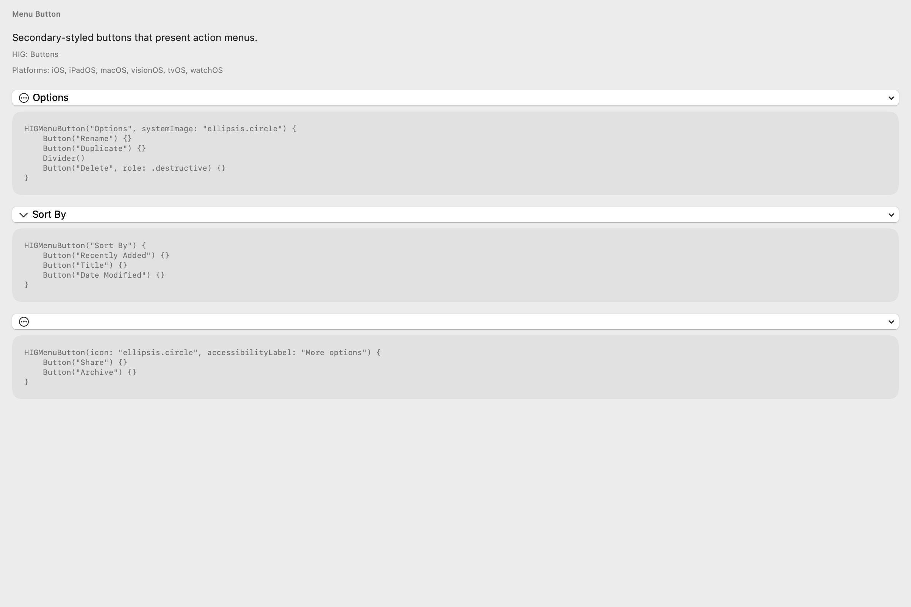
  
  

---

### HIGLink

| HIG category | Platforms | |
|---|---|---|
| [Links](https://developer.apple.com/design/human-interface-guidelines/links) | All 6 | Opens URLs via `@Environment(\.openURL)` |

**Guidelines:**
- Styled with accent color and underline
- Opens in default browser or in-app sheet
- Keep link text concise and descriptive
- Avoid "click here" — use the destination or action as the label

  
  
  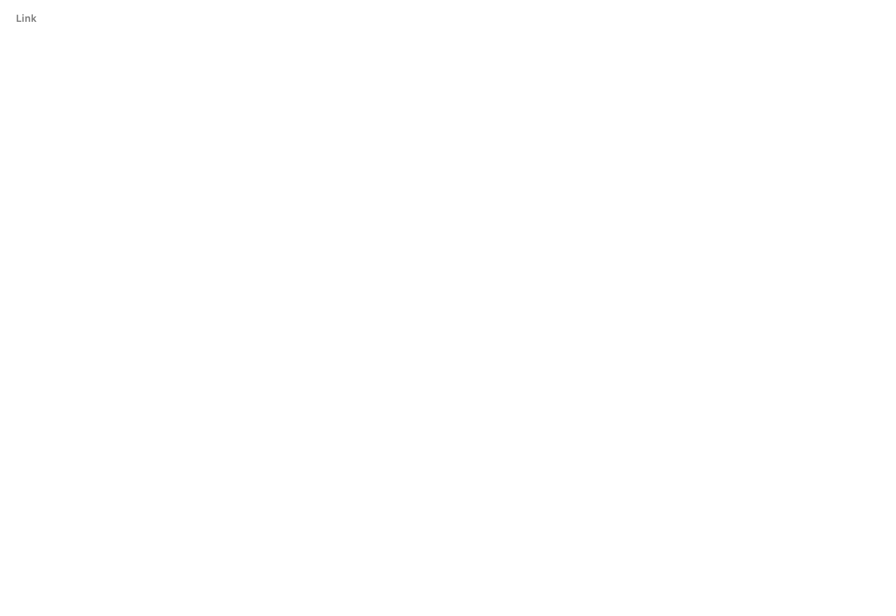

---

## Inputs

### HIGTextField

| HIG category | Platforms | States |
|---|---|---|
| [Text Fields](https://developer.apple.com/design/human-interface-guidelines/text-fields) | All 6 | empty · filled · focused · disabled · error |

**Guidelines:**
- Use a descriptive label above or a placeholder inside
- Show clear button when text is present
- Secure fields mask input for passwords
- Search fields show magnifying glass icon
- Use `.keyboardType()`, `.textContentType()`, `.submitLabel()` for context
- Validation feedback goes below the field, not inline

  
  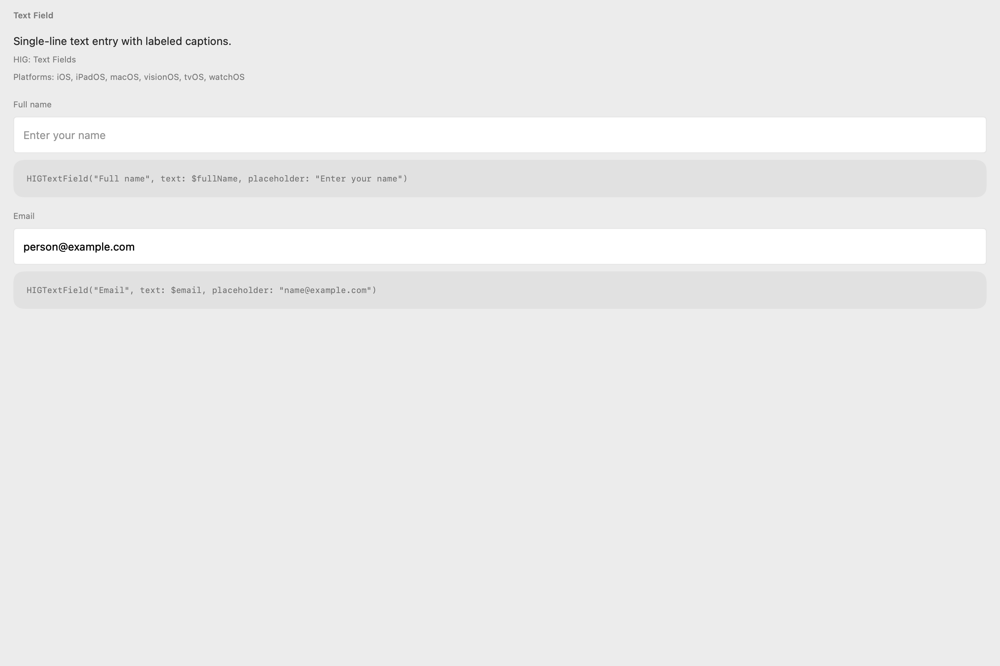

---

### HIGSecureField

| HIG category | Platforms | States |
|---|---|---|
| [Text Fields](https://developer.apple.com/design/human-interface-guidelines/text-fields) | All 6 | empty · filled · focused · masked · disabled |

**Guidelines:**
- Always masked by default (bullets)
- Provide a show/hide toggle for usability
- Use `.textContentType(.password)` or `.newPassword` for autofill
- Don't trim or reject characters silently — show validation errors

  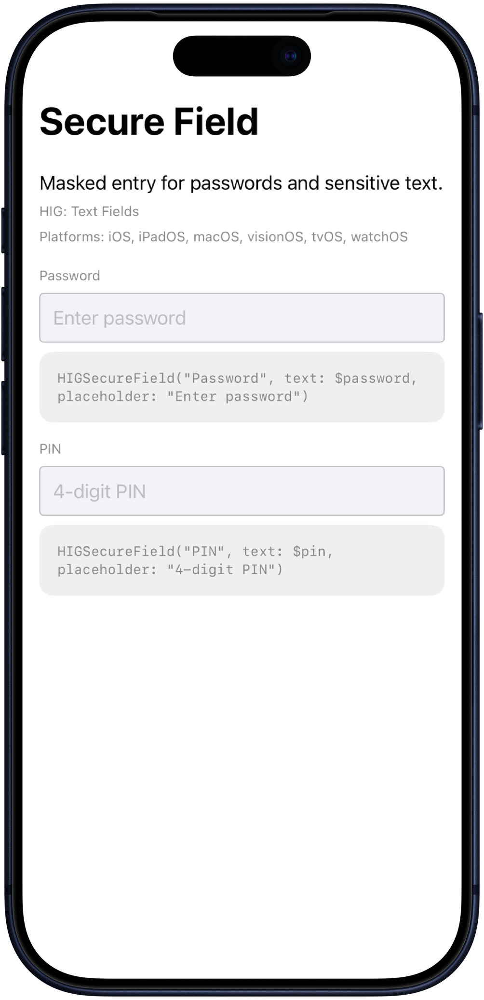

---

### HIGSearchField

| HIG category | Platforms | States |
|---|---|---|
| [Search Fields](https://developer.apple.com/design/human-interface-guidelines/search-fields) | All 6 | empty · focused · with text · with cancel |

**Guidelines:**
- Magnifying glass icon always visible
- Clear button appears when text is entered
- Cancel/dismiss when appropriate (iOS)
- Placeholder should suggest search scope ("Search contacts")
- Don't auto-dismiss keyboard on scroll without clear affordance

  
  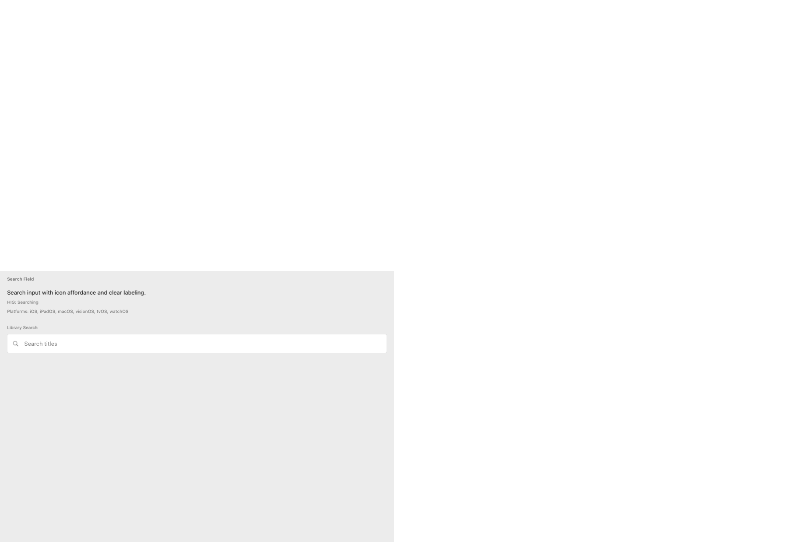

---

### HIGTextEditor

| HIG category | Platforms | States |
|---|---|---|
| [Text Fields](https://developer.apple.com/design/human-interface-guidelines/text-fields) | All 6 | empty · filled · focused · disabled · scrollable |

**Guidelines:**
- Multi-line freeform text entry
- Show character count if there's a limit
- Support keyboard dismissal
- Scrollable when content exceeds bounds
- Respect Dynamic Type for body text

  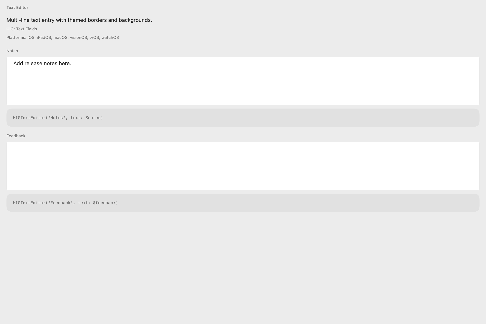
  

---

### HIGLongTextEditor (Rich Text)

| HIG category | Platforms | States |
|---|---|---|
| Rich Text Editing | iOS, iPadOS, macOS, visionOS | edit · format · preview · toolbar visible/hidden |

**Guidelines:**
- WebKit-backed rich text with bold, italic, underline, lists, links, alignment
- Formatting toolbar visible during editing
- Supports HTML import/export
- Use for notes, emails, document composition exceeding basic `HIGTextEditor`
- Keyboard shortcuts where available (macOS/iPadOS)

  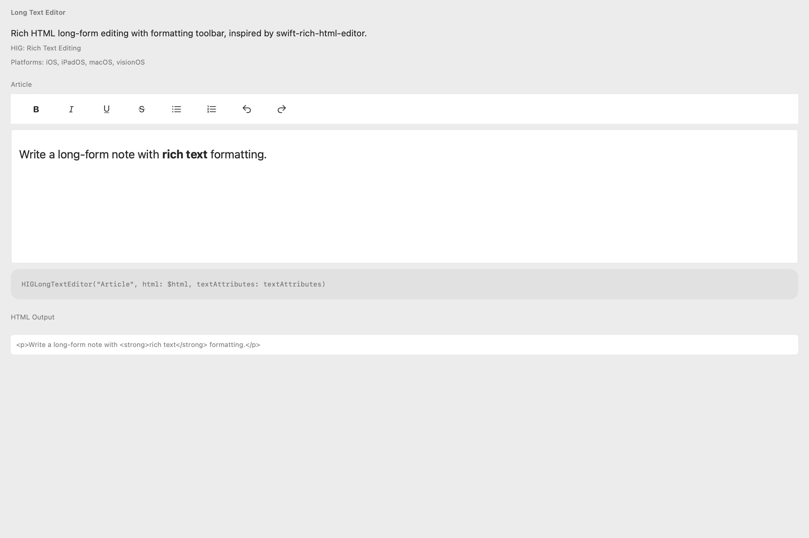
  

---

### HIGPicker

| HIG category | Platforms | Styles |
|---|---|---|
| [Pickers](https://developer.apple.com/design/human-interface-guidelines/pickers) | All 6 | menu · wheel · segmented · inline |

**Guidelines:**
- Use menu style for compact selection from lists
- Wheel style for date/time or large option sets
- Segmented style for 2–5 related choices
- Don't truncate option labels — prefer shorter labels
- Selection change is immediate (no "Apply" step)

  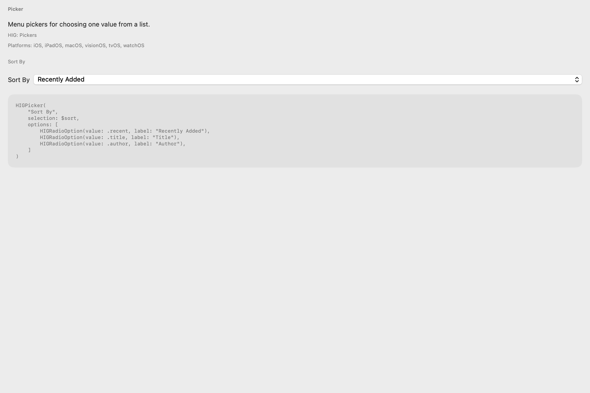
  

---

### HIGPhotoPicker (iOS-only)

| HIG category | Platforms | States |
|---|---|---|
| Photo Picker | iOS | browse · album picker · selection · preview · limited access |

**Guidelines:**
- Native PHPicker-style browsing with grid and album support
- Single or multi-select modes
- Handles limited library access gracefully
- Preview with crop/zoom support
- Requires `NSPhotoLibraryUsageDescription` in Info.plist
- iCloud asset loading with progress indication

  
  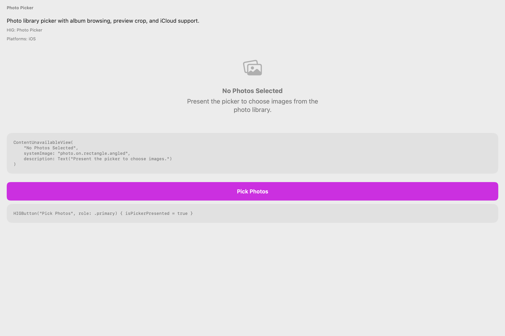

---

### HIGPhotoEditor (iOS-only)

| HIG category | Platforms | States |
|---|---|---|
| Photo Editing | iOS | crop · rotate · aspect ratio · reset · confirm |

**Guidelines:**
- Crop and rotation overlays with grid guide
- Preset aspect ratios (square, 4:3, 3:2, 16:9, freeform)
- Rotation in 90° increments
- Reset to original
- Toolbar chrome styled via theme tokens
- Returns processed `UIImage` or `Data`

  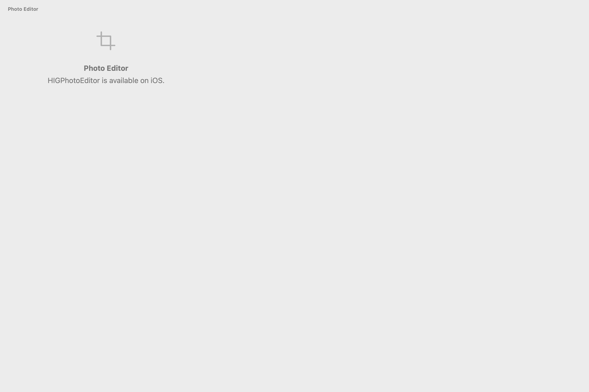
  

---

## Controls

### HIGToggle

| HIG category | Platforms | States |
|---|---|---|
| [Toggles](https://developer.apple.com/design/human-interface-guidelines/toggles) | All 6 | on · off · disabled |

**Guidelines:**
- Maps to platform-native switch appearence
- Label should describe the controlled setting, not the current state
- Don't nest toggles in navigation rows that lead to detail — toggle inline instead
- Disabled state must maintain readability (not just dimmed)

  
  

---

### HIGCheckbox

| HIG category | Platforms | States |
|---|---|---|
| [Selection Controls](https://developer.apple.com/design/human-interface-guidelines/selection-controls) | All 6 | unchecked · checked · mixed · disabled |

**Guidelines:**
- For multi-select contexts (lists, settings)
- Indeterminate state for parent selections with partial children
- Label is part of the hit target — tap the label to toggle
- Use checkboxes for independent options, radio buttons for exclusive choices

  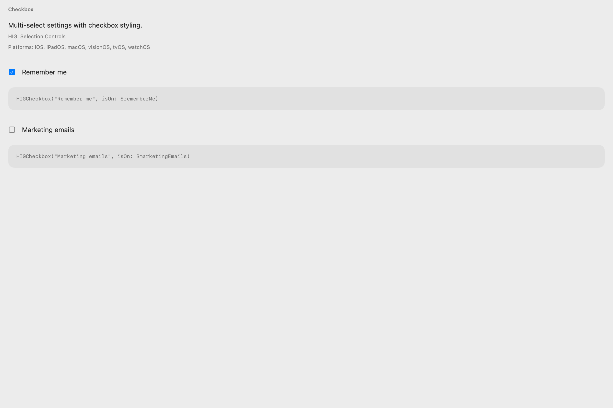
  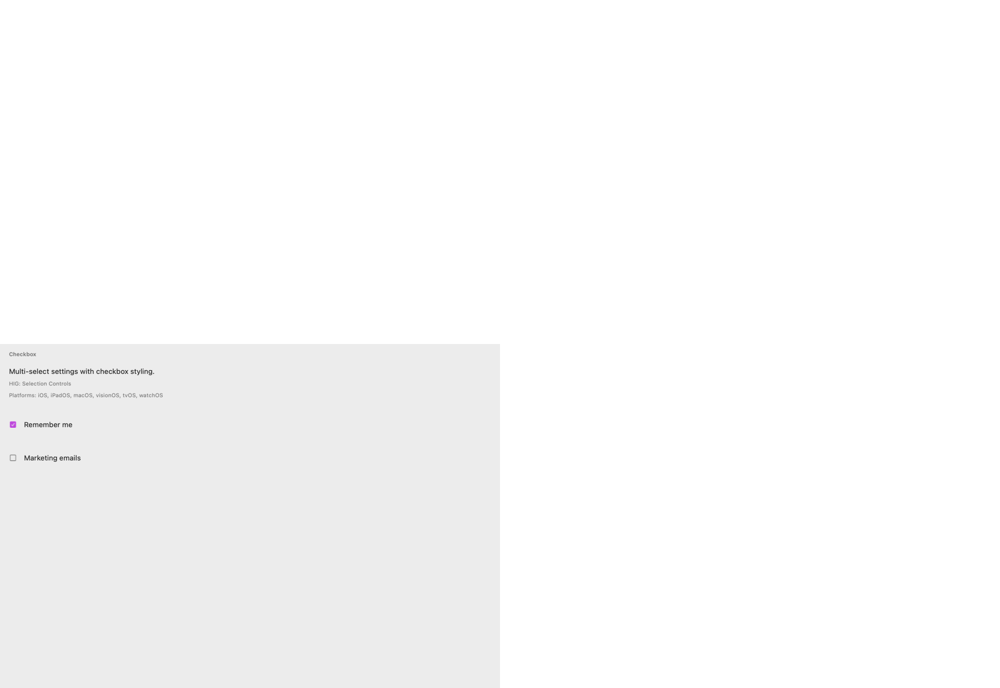

---

### HIGRadio

| HIG category | Platforms | States |
|---|---|---|
| [Selection Controls](https://developer.apple.com/design/human-interface-guidelines/selection-controls) | All 6 | selected · unselected · disabled |

**Guidelines:**
- For mutually exclusive choices in a group
- Always present ≥2 options
- One option should be selected by default
- Group with a clear label describing the choice set

  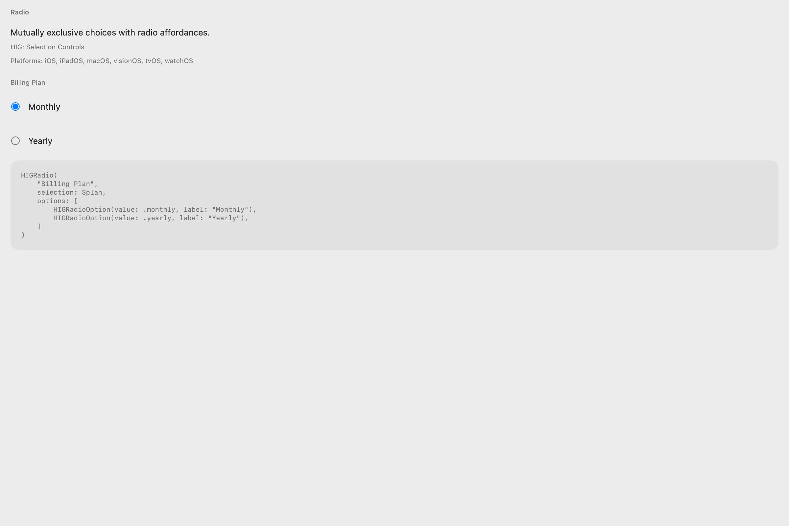
  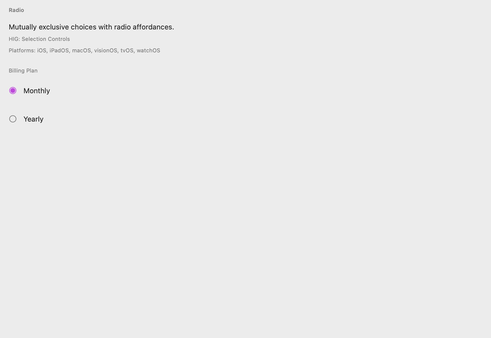

---

### HIGSegmentedControl

| HIG category | Platforms | States |
|---|---|---|
| [Segmented Controls](https://developer.apple.com/design/human-interface-guidelines/segmented-controls) | iOS, iPadOS, macOS, visionOS, tvOS | selected · unselected · disabled |

**Guidelines:**
- 2–5 segments ideal; up to ~8 acceptable on wider layouts
- Segment labels should be short nouns or verbs
- Don't mix text and icons in a single control
- Maintain proportional widths when possible
- Use for filtering views, not navigation

  
  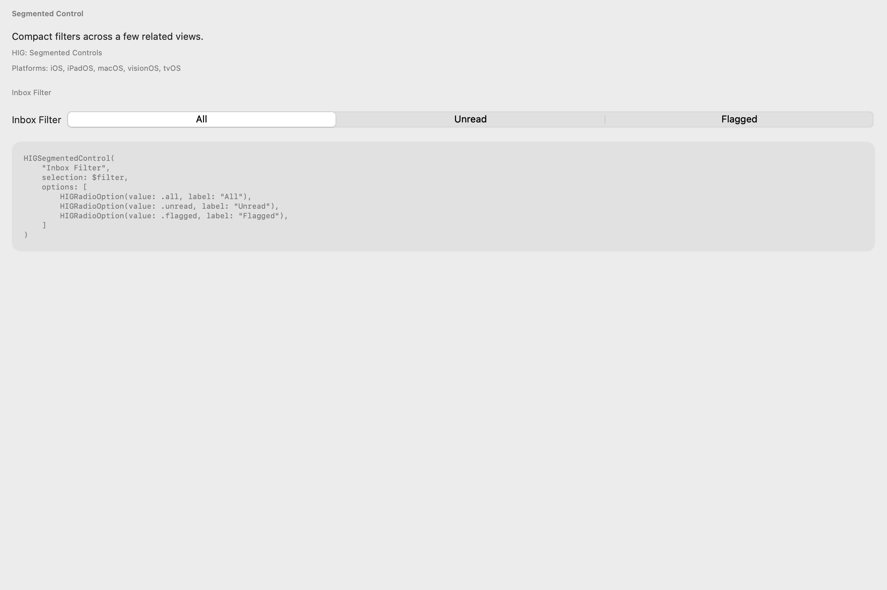

---

### HIGSlider

| HIG category | Platforms | States |
|---|---|---|
| [Sliders](https://developer.apple.com/design/human-interface-guidelines/sliders) | iOS, iPadOS, macOS, visionOS | normal · editing · disabled |

**Guidelines:**
- Show current value, especially if exact value matters
- Min/max labels optional but recommended
- Snap to meaningful increments when appropriate
- Use `.accessibilityValue` for VoiceOver

  
  

---

### HIGStepper

| HIG category | Platforms | States |
|---|---|---|
| [Steppers](https://developer.apple.com/design/human-interface-guidelines/steppers) | All 6 | normal · disabled · at limit |

**Guidelines:**
- For small incremental value changes (e.g. quantity ±1)
- Always pair with a label describing what's being changed
- Show the current value between increment/decrement buttons
- Clamp to min/max — disable appropriate button at boundaries
- Don't use for values that change dramatically between steps

  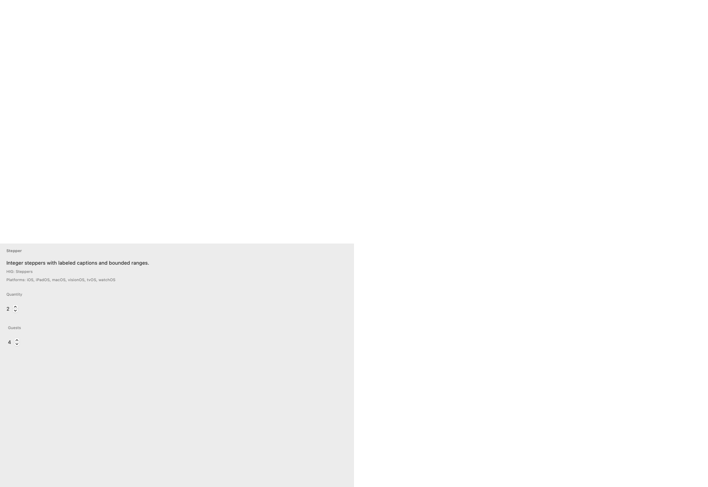
  

---

## Content

### HIGLabel

| HIG category | Platforms | Styles |
|---|---|---|
| [Labels](https://developer.apple.com/design/human-interface-guidelines/labels) | All 6 | `.title` `.headline` `.body` `.caption` `.footnote` |

**Guidelines:**
- Title for primary screen headings, body for content, caption for metadata
- All styles respond to Dynamic Type
- Use semantic text styles — don't hardcode font sizes
- Labels inherit the theme's typography tokens

  

---

### HIGBadge

| HIG category | Platforms | States |
|---|---|---|
| [Labels](https://developer.apple.com/design/human-interface-guidelines/labels) | All 6 | compact count · status dot · text badge |

**Guidelines:**
- For counts (unread messages, items in cart) or short status strings
- Compact: ≤2 digits or "99+"
- Don't use badges to convey critical information alone — always pair with a label
- Badge color comes from theme accent unless overridden

  
  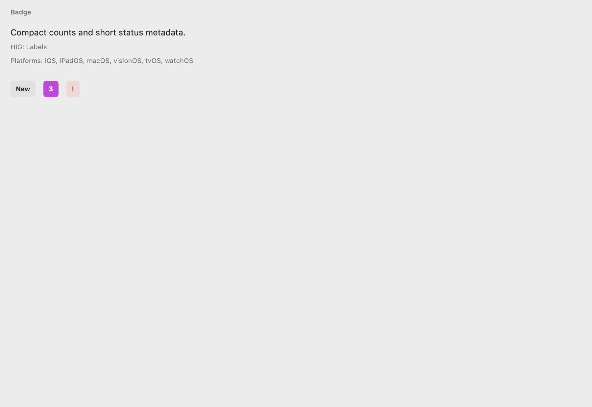

---

### HIGIcon

| HIG category | Platforms | Icon sets |
|---|---|---|
| [SF Symbols](https://developer.apple.com/design/human-interface-guidelines/sf-symbols) | All 6 | SF Symbols + Heroicons v2 (324 icons) |

**Guidelines:**
- SF Symbols for system-intrinsic icons (share, bookmark, etc.)
- Heroicons for custom app-level icons
- Size scales with Dynamic Type
- Use `.symbolRenderingMode()` for multi-color or hierarchical
- Icons adopt the theme's current tint/accent color

  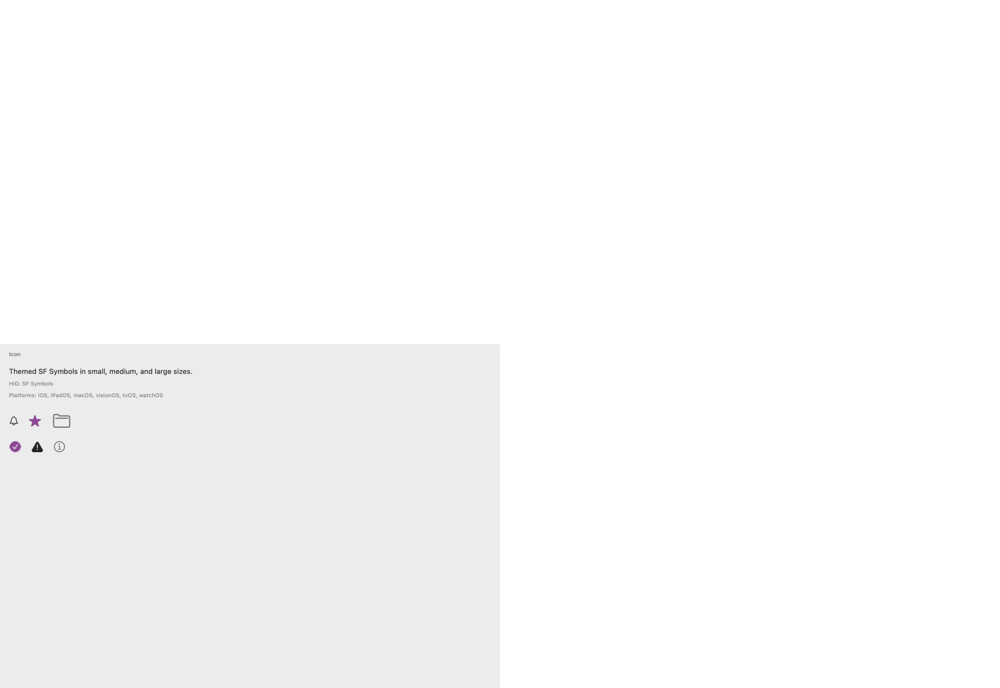
  

---

### HIGAvatar

| HIG category | Platforms | States |
|---|---|---|
| [Images](https://developer.apple.com/design/human-interface-guidelines/images) | All 6 | initials · image · placeholder · fallback |

**Guidelines:**
- Circular crop by default
- Shows initials derived from a name when no image is available
- Falls back to a person SF Symbol when initials can't be derived
- Supports async image loading
- Sizes: small (32pt), regular (44pt), large (64pt)

  
  

---

### HIGTag

| HIG category | Platforms | States |
|---|---|---|
| [Labels](https://developer.apple.com/design/human-interface-guidelines/labels) | All 6 | default · selected · removable · disabled |

**Guidelines:**
- Pill-shaped chips for categories, filters, and metadata
- Removable variant shows an × button
- Selected state shows filled background
- Wrap to next line in tight layouts
- Use 2–3 words max per tag

  
  

---

### HIGBulletList

| HIG category | Platforms | |
|---|---|---|
| [Typography](https://developer.apple.com/design/human-interface-guidelines/typography) | All 6 | Ordered and unordered lists |

**Guidelines:**
- Unordered: bullet points with theme-spaced indentation
- Ordered: numbered with automatic increment
- Spacing between items uses theme tokens
- All text uses Dynamic Type body style
- Nested lists supported with progressive indentation

  
  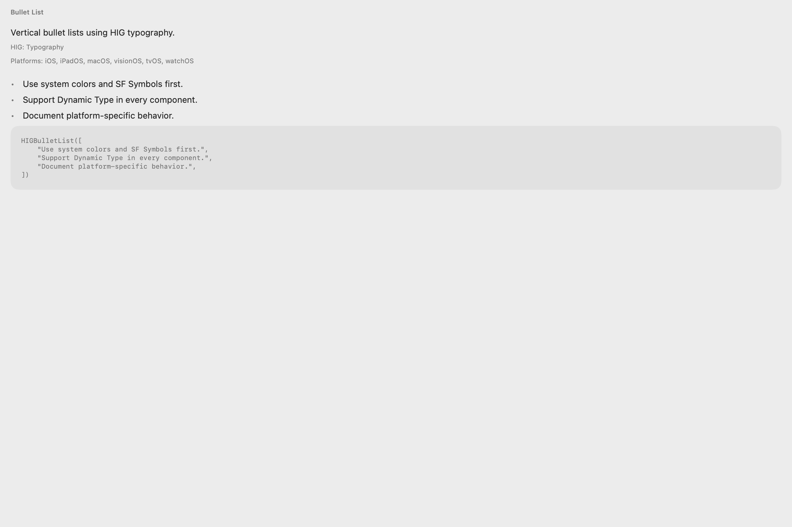

---

## Layout

### HIGDivider

| HIG category | Platforms | Orientations |
|---|---|---|
| [Layout](https://developer.apple.com/design/human-interface-guidelines/layout) | All 6 | horizontal · vertical |

**Guidelines:**
- Subtle separators, not attention-grabbing lines
- Use horizontal dividers between grouped content rows
- Vertical dividers for toolbar or sidebar section splits
- Thickness and color come from theme tokens
- Don't overuse — prefer whitespace and grouping first

  
  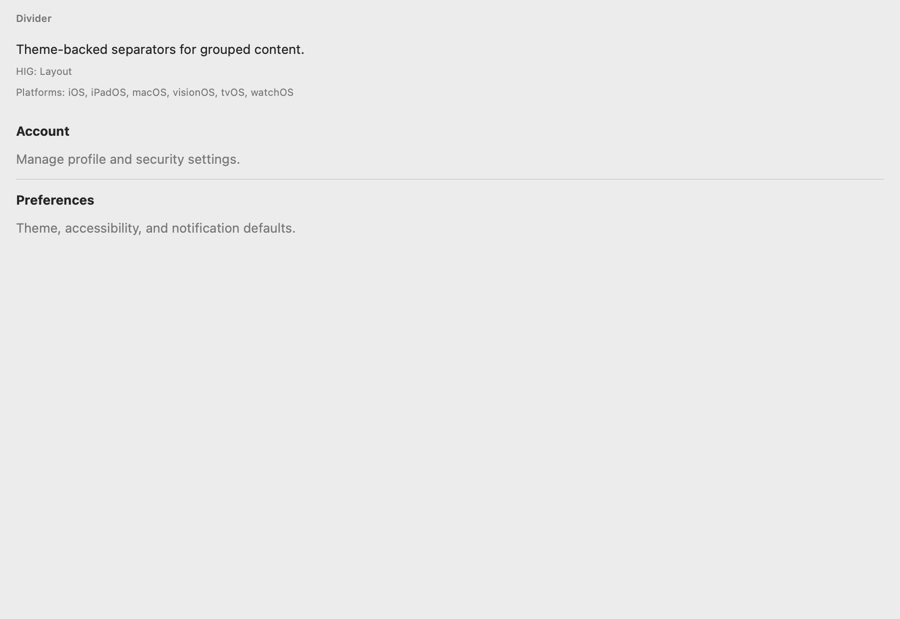

---

### HIGCard

| HIG category | Platforms | States |
|---|---|---|
| [Layout](https://developer.apple.com/design/human-interface-guidelines/layout) | All 6 | elevated · outlined · interactive |

**Guidelines:**
- Groups related content with a rounded background surface
- Elevated style adds shadow for depth
- Outlined style for flat appearance
- Interactive cards show hover/press feedback
- Inner padding and corner radius from theme tokens

  
  

---

### HIGPanel

| HIG category | Platforms | Features |
|---|---|---|
| [Layout](https://developer.apple.com/design/human-interface-guidelines/layout) | All 6 | title · description · refresh · collapse · close · footer |

**Guidelines:**
- Primary admin dashboard surface (Remark panel role) with HIG-native chrome
- Optional header actions: refresh, collapse/expand, close
- Body and footer are ViewBuilder slots
- Resolve padding, radius, fonts, and colors from `theme.panel` / semantic tokens
- Prefer `HIGCard` for simple grouping; use `HIGPanel` when action chrome is required
- Works with optional `HIGAdminTheme` for denser admin spacing

---

### HIGBreadcrumb

| HIG category | Platforms | Features |
|---|---|---|
| [Navigation](https://developer.apple.com/design/human-interface-guidelines/) | All 6 | ancestors · current · chevron separators |

**Guidelines:**
- Show hierarchy from root to current page
- Last segment is current (primary, non-interactive)
- Ancestors use accent color when `onSelect` is provided
- Minimum tap targets from `theme.breadcrumb`
- Prefer wrapping to a vertical stack on very narrow widths

---

### HIGPageHeader

| HIG category | Platforms | Features |
|---|---|---|
| [Navigation](https://developer.apple.com/design/human-interface-guidelines/) | All 6 | title · subtitle · breadcrumb · trailing |

**Guidelines:**
- One clear page title as the primary header
- Optional breadcrumb above the title for admin hierarchy
- Trailing slot for primary page actions (e.g. Compose)
- Use `theme.pageHeader` fonts and spacing; pair with `HIGAdminTheme` for denser dashboards

---

### HIGPagination

| HIG category | Platforms | Features |
|---|---|---|
| [Navigation](https://developer.apple.com/design/human-interface-guidelines/) | All 6 | prev · next · page numbers · ellipsis |

**Guidelines:**
- Use for long tables/lists; keep current page selected
- 1-based page index; clamp into valid range
- Minimum 44pt targets from `theme.pagination`
- Prefer fewer visible pages on compact widths (`maxVisiblePages`)

---

### HIGTabs

| HIG category | Platforms | Features |
|---|---|---|
| [Navigation](https://developer.apple.com/design/human-interface-guidelines/) | All 6 | underline selection · horizontal scroll |

**Guidelines:**
- For in-page section switching — not top-level app structure (`HIGTabBar`)
- Prefer `HIGSegmentedControl` when options are few and equal-weight filters
- Selected tab uses accent underline and semibold label

---

### HIGAccordion

| HIG category | Platforms | Features |
|---|---|---|
| [Layout](https://developer.apple.com/design/human-interface-guidelines/layout) | All 6 | multi-expand · single-expand · chevron |

**Guidelines:**
- Group related dense settings without forcing long scroll
- `allowsMultipleExpanded: false` for exclusive FAQ-style panels
- Respect Reduce Motion for expand/collapse animation

---

### HIGSteps

| HIG category | Platforms | Features |
|---|---|---|
| [Navigation](https://developer.apple.com/design/human-interface-guidelines/) | All 6 | horizontal · vertical · completed · current · upcoming |

**Guidelines:**
- Use for multi-step wizards and checkout flows
- Zero-based `currentIndex`; completed steps show checkmarks
- Prefer vertical on narrow widths (automatic fallback from horizontal)
- Optional `onSelect` for revisiting completed steps

---

### HIGPearlSteps

| HIG category | Platforms | Features |
|---|---|---|
| [Navigation](https://developer.apple.com/design/human-interface-guidelines/) | All 6 | dots · connectors · optional selection |

**Guidelines:**
- Compact progress when titles would clutter
- Prefer `HIGSteps` when each stage needs a label
- Keep pearl count small (typically ≤7)

---

### HIGTimeline

| HIG category | Platforms | Features |
|---|---|---|
| [Layout](https://developer.apple.com/design/human-interface-guidelines/layout) | All 6 | markers · connectors · timestamps · SF Symbol markers |

**Guidelines:**
- Use for activity feeds, order history, and audit logs
- Newest-first or chronological order is a product choice — keep order stable
- Optional `systemImage` on markers; plain accent dots when omitted
- Resolve spacing and type from `theme.timeline`

---

### HIGStatusIndicator

| HIG category | Platforms | States |
|---|---|---|
| [Status](https://developer.apple.com/design/human-interface-guidelines/) | All 6 | online · away · busy · offline |

**Guidelines:**
- Compact presence affordance for lists, chat, and admin tables
- Pair with `HIGAvatar(..., status:)` for badge overlays
- Colors map to semantic theme roles (accent / warning / destructive / secondary)

---

### HIGEmptyState

| HIG category | Platforms | Features |
|---|---|---|
| [Empty states](https://developer.apple.com/design/human-interface-guidelines/) | All 6 | icon · title · message · actions |

**Guidelines:**
- Explain what is empty and what to do next
- Keep primary action singular when possible
- Center content; cap width via `theme.emptyState.maxContentWidth`

---

### HIGList

| HIG category | Platforms | Styles |
|---|---|---|
| [Lists and Tables](https://developer.apple.com/design/human-interface-guidelines/lists-and-tables) | All 6 | plain · grouped · insetGrouped |

**Guidelines:**
- Themed list container with appropriate background
- Plain for full-width rows, grouped for settings-style
- Row separators use theme divider tokens
- Swipe actions where appropriate (iOS/iPadOS)
- Empty state should show a helpful message, not a blank screen

  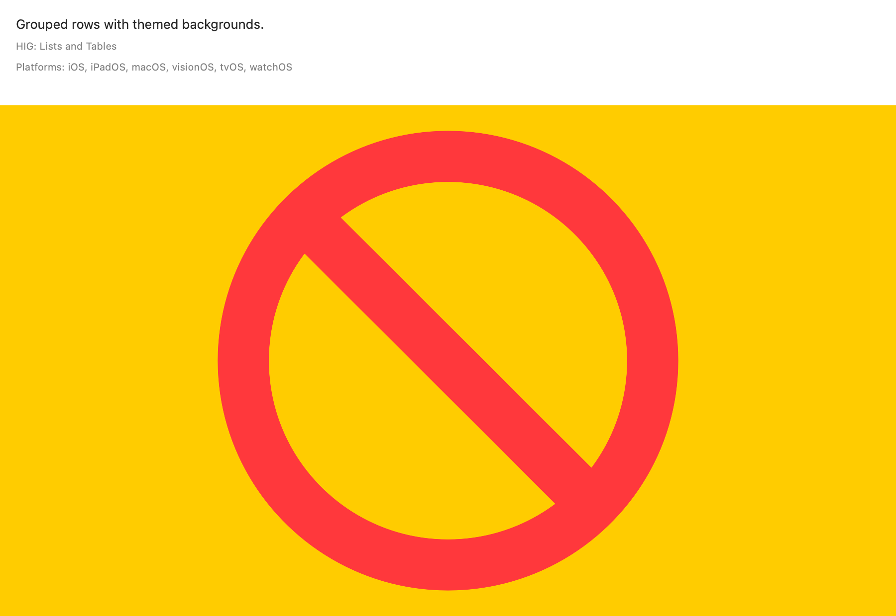
  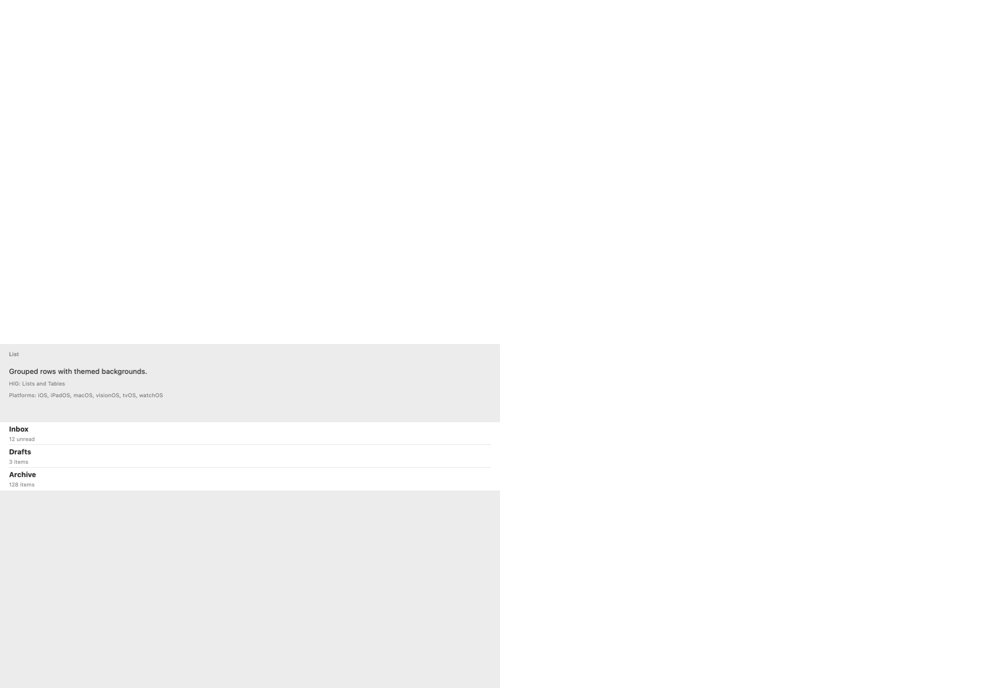

---

### HIGForm

| HIG category | Platforms | Sections |
|---|---|---|
| [Settings](https://developer.apple.com/design/human-interface-guidelines/settings) | All 6 | header · footer · grouped rows |

**Guidelines:**
- Sectioned form groups ideal for settings
- Each section has an optional header and footer
- Rows use system group row styling
- Use for settings, preferences, and data entry forms
- Group 3–8 related fields per section

  
  

---

## Navigation

### HIGTabBar

| HIG category | Platforms | States |
|---|---|---|
| [Tab Bars](https://developer.apple.com/design/human-interface-guidelines/tab-bars) | iOS, iPadOS, macOS, visionOS, tvOS | selected · unselected · badge |

**Guidelines:**
- 3–5 tabs ideal; never more than 5 on iOS
- Use SF Symbols for tab icons
- Labels should be a single word
- Badge counts for notifications
- Tap the selected tab to return to root (iOS)

  
  

---

### HIGToolbar

| HIG category | Platforms | Placements |
|---|---|---|
| [Toolbars](https://developer.apple.com/design/human-interface-guidelines/toolbars) | All 6 | bottomBar · navigationBarTrailing · keyboard · status |

**Guidelines:**
- For screen-level actions, not navigation
- iOS: bottom toolbar with 2–5 icon buttons
- macOS: window toolbar with customizable items
- Avoid mixing navigation and toolbar actions
- Use SF Symbols consistently

  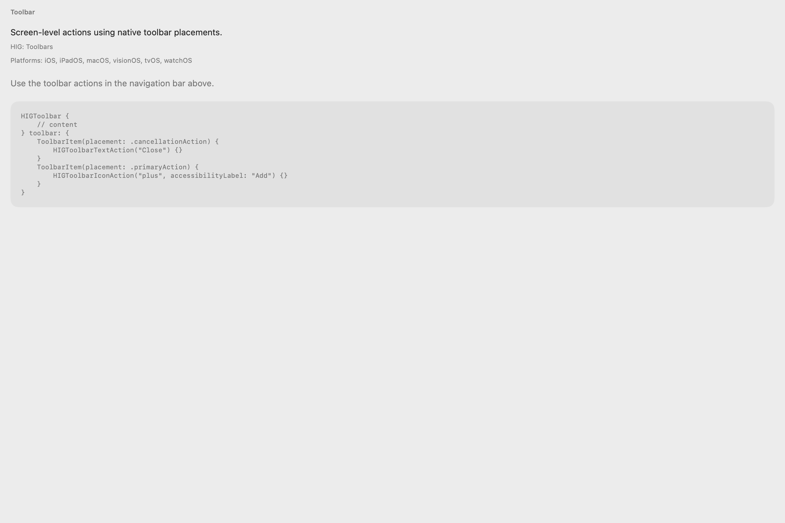
  

---

### HIGSidebar

| HIG category | Platforms | States |
|---|---|---|
| [Split Views](https://developer.apple.com/design/human-interface-guidelines/split-views) | iOS, iPadOS, macOS, visionOS | expanded · collapsed · hidden |

**Guidelines:**
- For master-detail navigation on regular-width devices
- Use SF Symbols for sidebar items
- Collapsible on iOS, persistent on macOS
- Three-column layout supported (sidebar → list → detail)
- Selection highlight uses theme accent color

  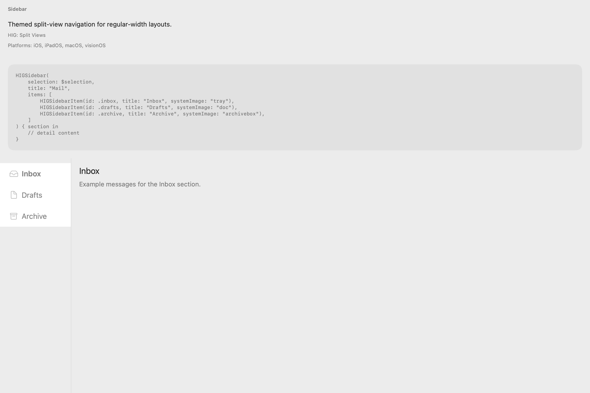
  

---

### HIGNavigationBar

| HIG category | Platforms | Content |
|---|---|---|
| [Navigation Bars](https://developer.apple.com/design/human-interface-guidelines/navigation-bars) | All 6 | title · leading · trailing · large title |

**Guidelines:**
- Title is required; leading/trailing actions optional
- Large title for top-level screens, inline for drill-down
- Back button is automatic in navigation stacks
- Trailing section supports multiple buttons
- Search can be integrated into the navigation bar

  
  

---

## Feedback

### HIGActivityIndicator

| HIG category | Platforms | Styles |
|---|---|---|
| [Loading](https://developer.apple.com/design/human-interface-guidelines/loading) | All 6 | `.system` `.circular` `.linear` |

**Guidelines:**
- For indeterminate loading states
- System: platform-native spinner (iOS UIActivityIndicatorView style)
- Linear: progress bar for determinate operations
- Show a label alongside for long operations ("Loading results…")
- Use `.accessibilityLabel` to announce "Loading" to VoiceOver

  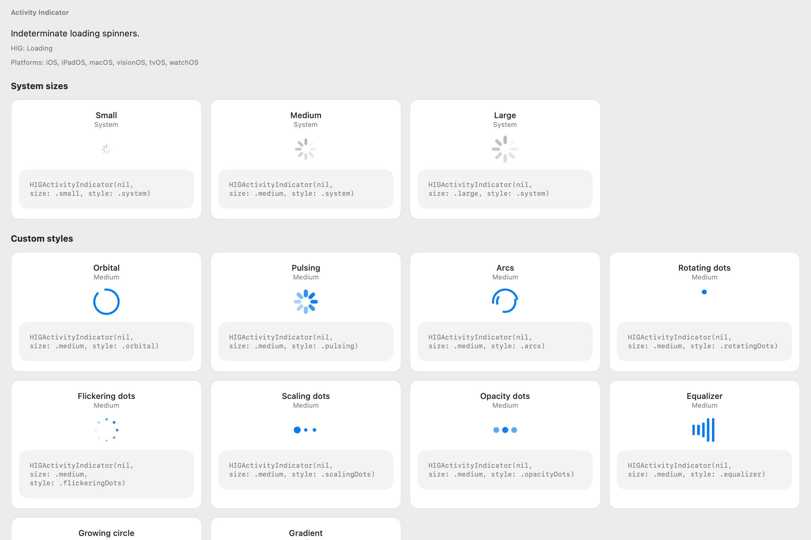
  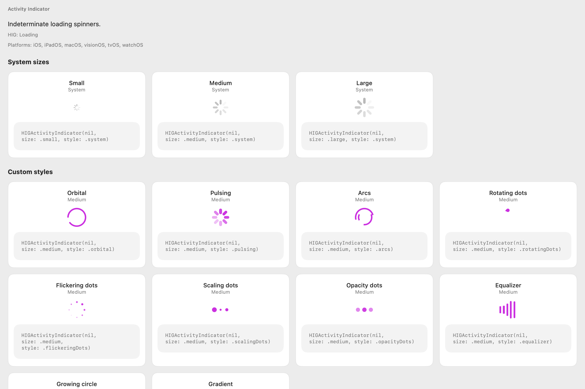

---

### HIGProgressView

| HIG category | Platforms | Styles |
|---|---|---|
| [Progress Indicators](https://developer.apple.com/design/human-interface-guidelines/progress-indicators) | All 6 | `.linear` `.circular` · determinate · indeterminate |

**Guidelines:**
- Determinate: show completed/total (e.g. 6/10)
- Indeterminate: animation signals ongoing work
- Linear: horizontal bar, circular: ring
- Always label what's in progress ("Downloading 4 of 12 files")
- Don't use indeterminate progress for operations longer than a few seconds — add detail

  
  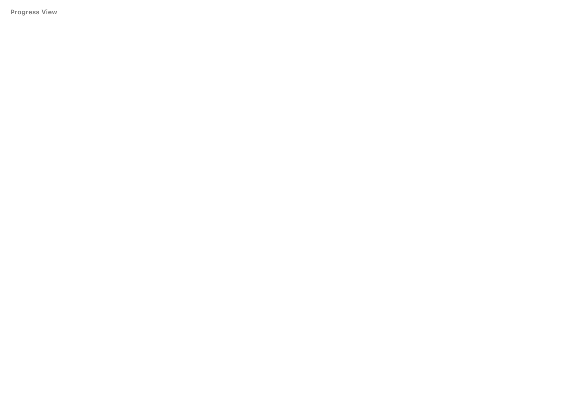

---

### HIGAlert

| HIG category | Platforms | Styles |
|---|---|---|
| [Alerts](https://developer.apple.com/design/human-interface-guidelines/alerts) | All 6 | `.banner` · `.modal` |

**Guidelines:**
- Banner: inline notification at top of screen, auto-dismissing
- Modal: requires user action (typically destructive or critical)
- Keep alert text concise — title + ≤2 lines of body
- Button roles: `.default`, `.cancel`, `.destructive`
- Don't use alerts for non-critical information — prefer HIGToast

  
  

---

### HIGToast

| HIG category | Platforms | States |
|---|---|---|
| Component Notifications | All 6 | single · queued · dismissible |

**Guidelines:**
- Transient status messages (success, warning, info, error)
- Auto-dismiss after a configurable duration (default ~4s)
- Queued toasts display sequentially — no stacking
- Use for non-blocking feedback (e.g. "Copied", "Saved")
- Position: bottom (iOS) or trailing (macOS)

  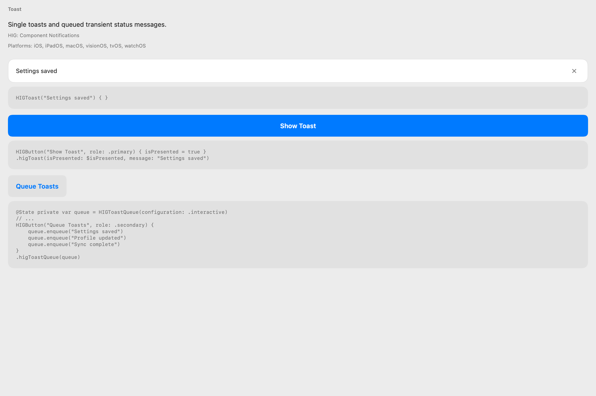
  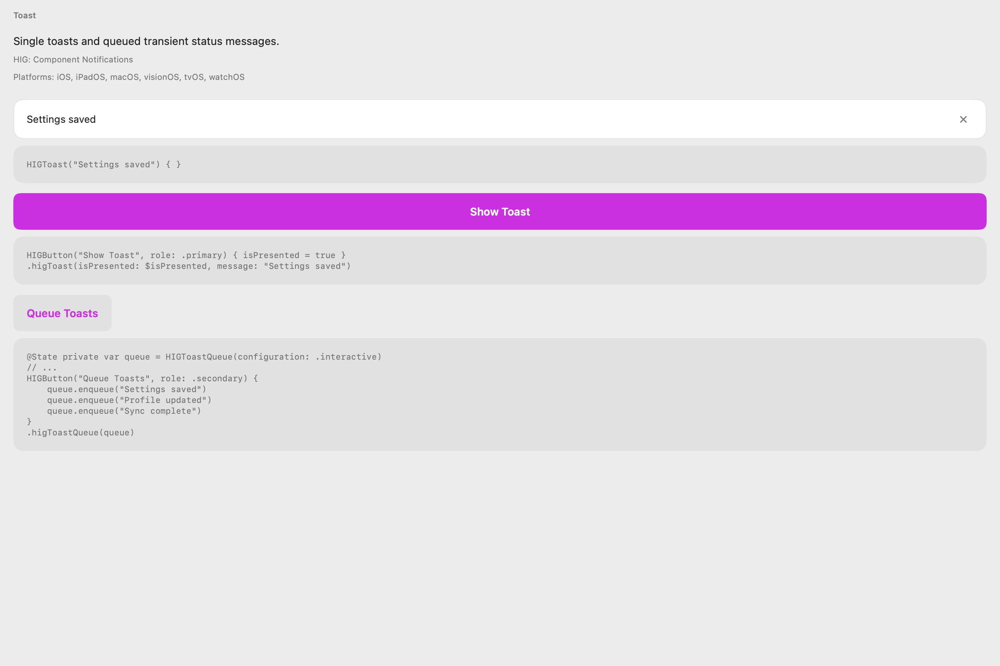

---

## Theme Variants Quick Reference

| Component | System Light | Brand Light | High Contrast Light |
|---|---|---|---|
| Button |  |  |  |
| Toggle |  |  |  |
| TextField |  |  |  |
| Card |  |  | 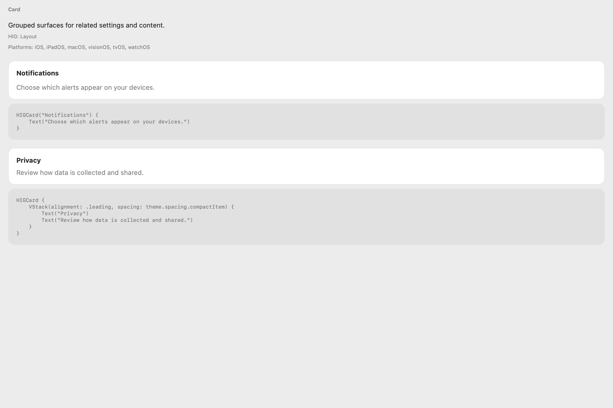 |
| TabBar |  |  |  |
| Toast |  |  |  |
| Icon |  |  |  |
| Alert |  |  | 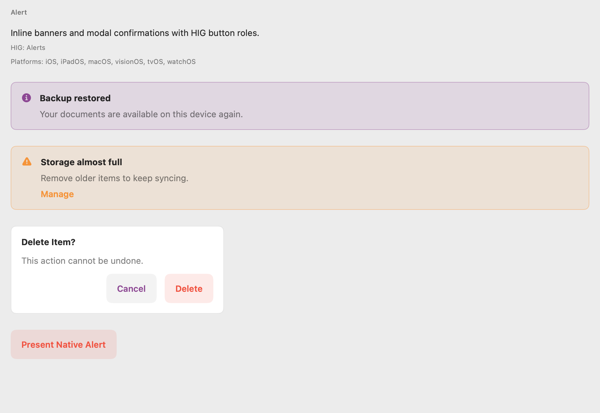 |

---

## Accessibility Master Checklist

Every component must satisfy:

- [ ] Dynamic Type — scales to all sizes including Accessibility sizes
- [ ] Increase Contrast — visible borders and separators
- [ ] Reduce Motion — animations disabled or simplified
- [ ] VoiceOver — meaningful `.accessibilityLabel` and `.accessibilityValue`
- [ ] Keyboard — all interactive elements reachable via Tab/arrow keys (macOS/tvOS)
- [ ] Touch target — minimum 44×44pt hit area (iOS/iPadOS/watchOS)
- [ ] Color — no information conveyed by color alone

---

## PR Checklist

- [ ] Component follows its HIG category guidelines above
- [ ] All states shown in Showcase
- [ ] Theme variant snapshots exist (system, brand, high contrast × light, dark)
- [ ] iOS platform snapshot captured
- [ ] `#Preview` in component source file
- [ ] Accessibility checklist passed
- [ ] Requirements updated at `Requirements/Components/REQ.md`
