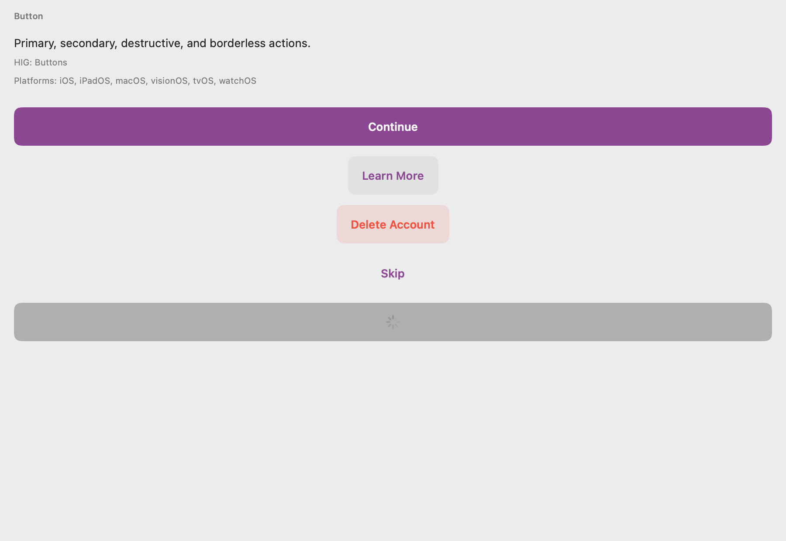
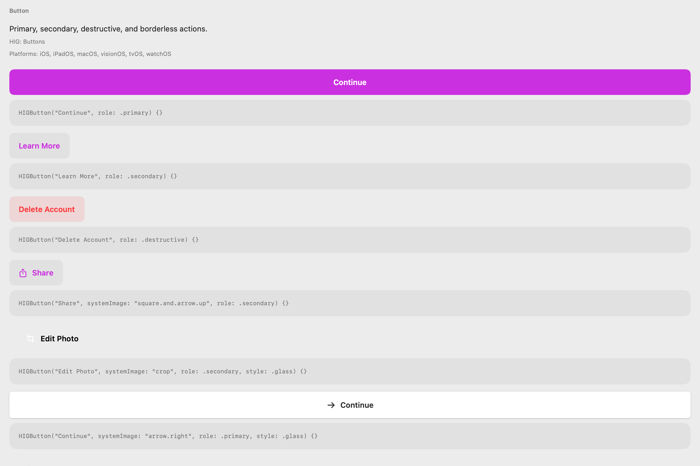
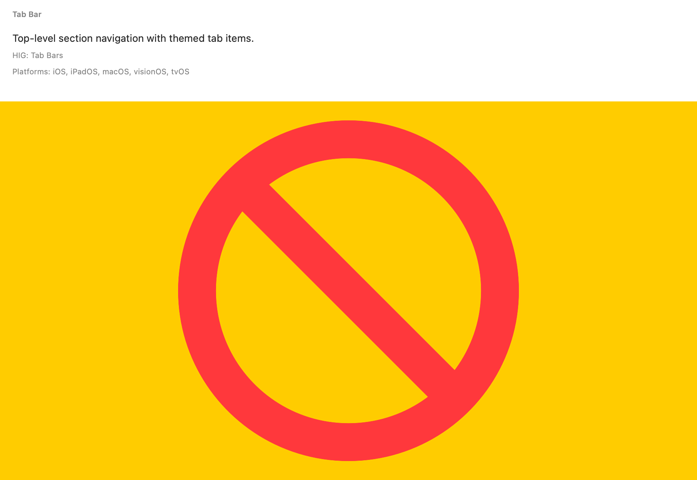
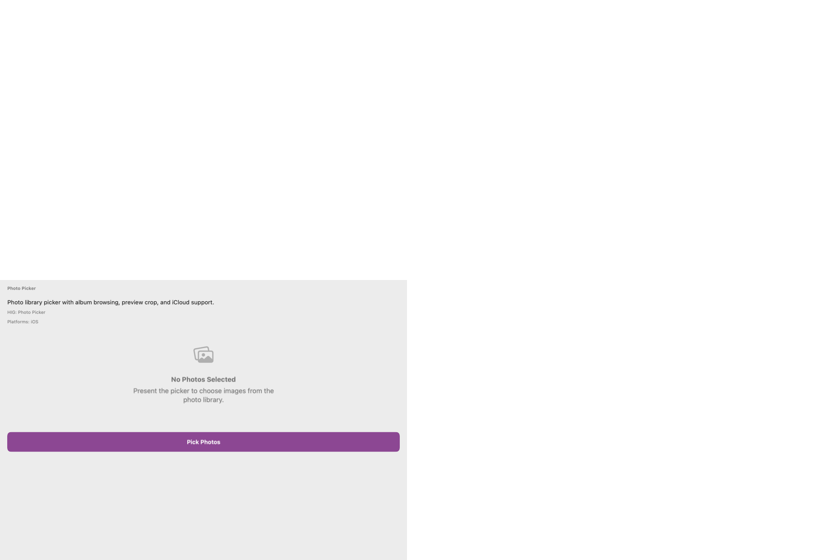
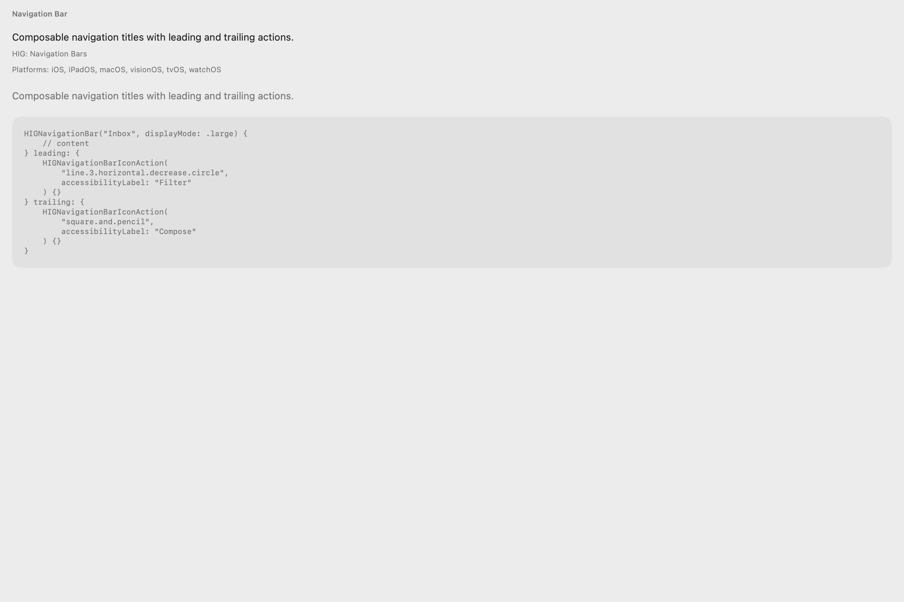

# HIGDesign

### The SwiftUI design system that actually follows Apple HIG — on every Apple platform.

Stop rebuilding buttons, forms, and navigation chrome from scratch. HIGDesign gives you **33 production-ready components**, a **layered token system**, and **one-line theme switching** — so your app looks native on iPhone, iPad, Mac, Apple TV, Apple Watch, and visionOS.

<p align="center">
  
  &nbsp;&nbsp;
  
</p>
<p align="center"><sub>Same component · swap <code>HIGSystemTheme()</code> for <code>HIGBrandTheme(name: "Acme", accent: .purple)</code></sub></p>

<p align="center">
  <a href="https://github.com/S-M-Technology-Ltd/HIGDesign/releases"></a>
  <a href="Package.swift"></a>
  <a href="Package.swift"></a>
  <a href="https://swiftpackageindex.com/S-M-Technology-Ltd/HIGDesign"></a>
  <a href="LICENSE"></a>
</p>

<p align="center">
  <a href="https://s-m-technology-ltd.github.io/HIGDesign/"><strong>🎨 Live component gallery</strong></a>
  &nbsp;·&nbsp;
  <a href="Docs/HOW_TO_USE.md">Docs</a>
  &nbsp;·&nbsp;
  <a href="https://github.com/S-M-Technology-Ltd/HIGDesign/releases">Releases</a>
</p>

---

## What is HIGDesign?

A **Swift Package** with HIG-correct SwiftUI components, design tokens, and themes. Import one product, wrap your app in `HIGThemeableView`, and use `HIGButton`, `HIGTextField`, `HIGTabBar`, and 30 more — each styled from tokens, not hardcoded values.

**No UIKit.** Swift 6. iOS 18+, macOS 15+, visionOS 2+, tvOS 18+, watchOS 11+.

## Why use it instead of raw SwiftUI?

| Raw SwiftUI | HIGDesign |
|-------------|-----------|
| You style every control yourself | 33 pre-built, HIG-aligned components |
| Spacing and colors drift across screens | Token layers enforce consistency |
| Brand theming means touching every view | Swap theme at the root — everything updates |
| Multi-platform means re-solving the same patterns | Platform-appropriate behavior built in |
| No visual regression baseline | 385 committed showcase snapshots in CI |

Native SwiftUI is the foundation. HIGDesign is the **opinionated layer** that saves weeks of design-system work while keeping you aligned with [Apple Human Interface Guidelines](https://developer.apple.com/design/human-interface-guidelines/).

## Quick start (copy & paste)

**1. Add the package** — Xcode → *Add Package Dependencies*:
```
https://github.com/S-M-Technology-Ltd/HIGDesign.git
```
(from `1.0.1`)

**2. Wrap your app:**

```swift
import HIGDesign

@main
struct MyApp: App {
    var body: some Scene {
        WindowGroup {
            HIGThemeableView(theme: HIGSystemTheme()) {
                VStack(spacing: 16) {
                    HIGTextField("Email", text: $email, placeholder: "you@example.com")
                    HIGToggle("Notifications", isOn: $notifications)
                    HIGButton("Continue", role: .primary) { }
                }
                .higPadding(.screenEdge)
            }
        }
    }
}
```

That's it. Full guide → **[Docs/HOW_TO_USE.md](Docs/HOW_TO_USE.md)**

## See it in action

<p align="center">
  
  
  
</p>
<p align="center">
  
  
  
</p>

Run the interactive showcase locally:

```bash
git clone https://github.com/S-M-Technology-Ltd/HIGDesign.git && cd HIGDesign
open Sample/HIGDesignSample.xcodeproj    # iOS + macOS catalog
swift run HIGShowcaseApp                 # macOS CLI showcase
```

Browse all components online → **[s-m-technology-ltd.github.io/HIGDesign](https://s-m-technology-ltd.github.io/HIGDesign/)**

## 33 components

| | Components |
|---|------------|
| **Actions** | Button, Menu Button |
| **Inputs** | Text Field, Secure Field, Search Field, Text Editor, Picker, Photo Picker *(iOS)* |
| **Controls** | Toggle, Checkbox, Radio, Segmented Control, Slider, Stepper |
| **Content** | Label, Badge, Icon, Avatar, Link, Tag, Bullet List |
| **Layout** | Divider, Card, List, Form Section |
| **Navigation** | Tab Bar, Toolbar, Sidebar, Navigation Bar |
| **Feedback** | Progress View, Activity Indicator, Alert, Toast |

Themes: **System** · **High Contrast** · **Brand accent** — each with light and dark variants.

## Features developers care about

- **Layered tokens** — `Raw → Semantic → Component → Theme` (no magic numbers in views)
- **Environment-driven theming** — `@Environment(\.higTheme)` everywhere
- **Modular SPM products** — `HIGDesign` umbrella or `HIGDesignCore` + `HIGDesignComponents`
- **DocC catalog** — open in Xcode → *Product → Build Documentation*
- **CI-verified** — token guards, snapshot diff, 45 unit tests, six-platform builds

## Documentation

| | |
|---|---|
| [Component gallery](https://s-m-technology-ltd.github.io/HIGDesign/) | Visual marketing site |
| [HOW_TO_USE.md](Docs/HOW_TO_USE.md) | Integration & theming |
| [Swift Package Index](https://swiftpackageindex.com/S-M-Technology-Ltd/HIGDesign) | Builds & API browser |
| [CHANGELOG.md](CHANGELOG.md) | Release notes |
| [ARCHITECTURE.md](Docs/ARCHITECTURE.md) | Module graph (for contributors) |
| [Requirements](Requirements/README.md) | Per-module requirements |

## Contributing

PRs welcome. Run before submitting (same checks as CI):

```bash
Scripts/run_pr_checks.sh
```

## License

MIT — see [LICENSE](LICENSE). Apple platform trademarks belong to Apple Inc.

---

<p align="center">
  <sub>If HIGDesign saves you time, consider ⭐ starring the repo — it helps other developers find it.</sub>
</p>