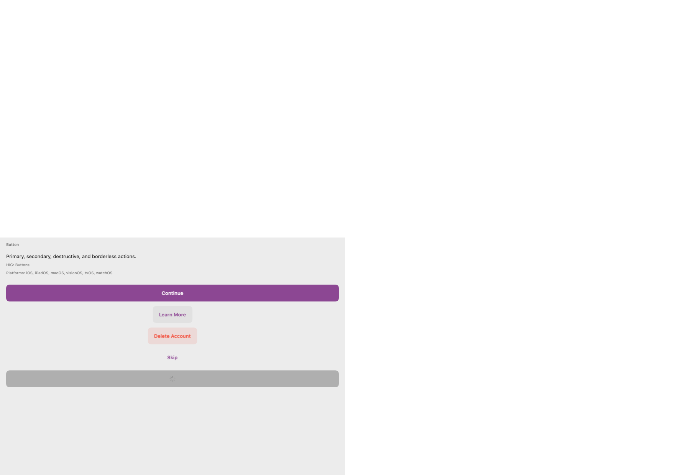
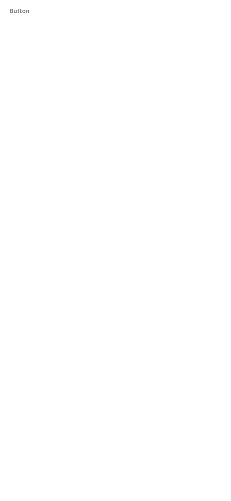
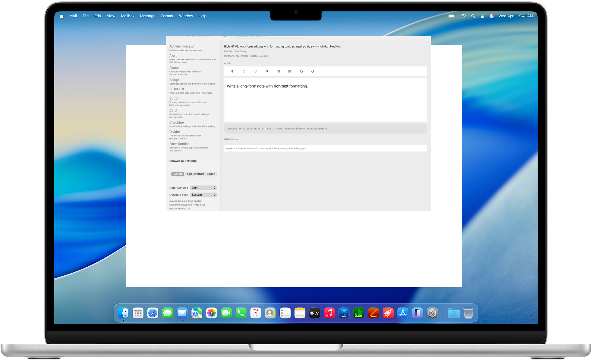
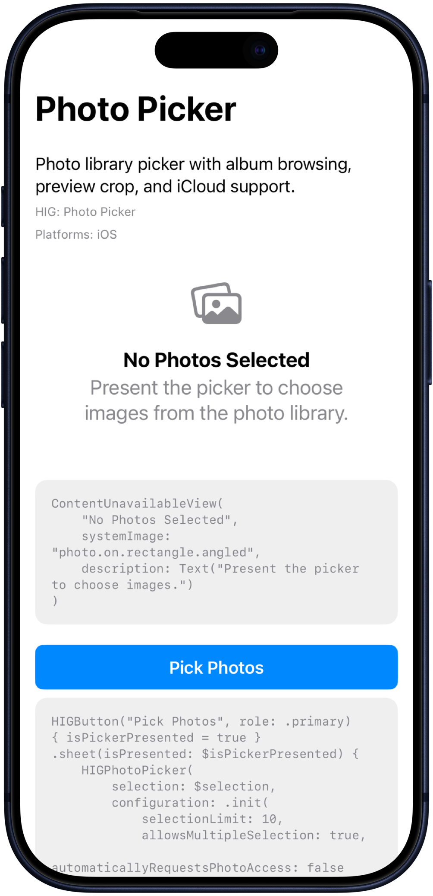
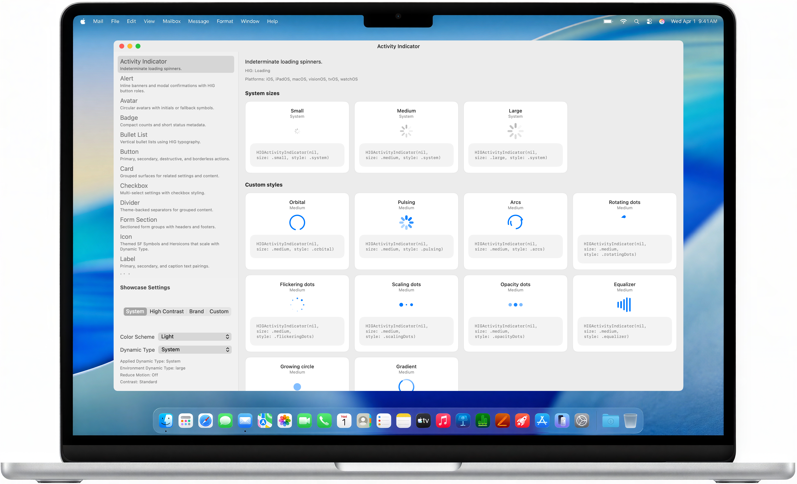
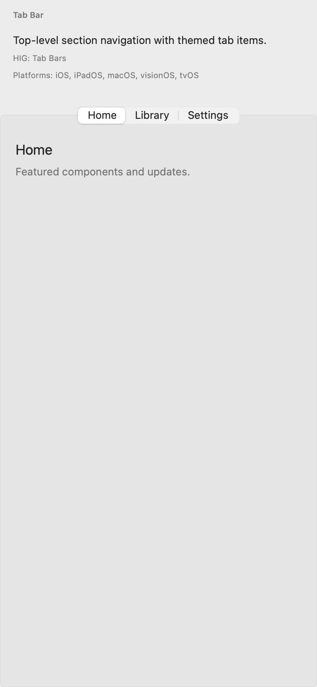

# HIGDesign

### Production-ready SwiftUI components that follow Apple HIG — on every Apple platform.

Ship native-looking iOS, iPadOS, macOS, visionOS, tvOS, and watchOS apps without reinventing buttons, forms, navigation, or theming. **35 HIG-aligned components**, a **layered token system**, and **one-line theme switching** — import once, wrap your app, and go.

<p align="center">
  
  &nbsp;
  
</p>
<p align="center"><sub>macOS catalog · iPhone device frame — system theme · light mode</sub></p>

<p align="center">
  <a href="https://github.com/promptdora/HIGDesign/stargazers"></a>
  <a href="https://github.com/promptdora/HIGDesign/releases"></a>
  <a href="Package.swift"></a>
  <a href="Package.swift"></a>
  <a href="https://swiftpackageindex.com/promptdora/HIGDesign"></a>
  <a href="LICENSE"></a>
</p>

<p align="center">
  <a href="https://promptdora.github.io/HIGDesign/"><strong>🎨 Live component gallery</strong></a>
  &nbsp;·&nbsp;
  <a href="Docs/HOW_TO_USE.md">Docs</a>
  &nbsp;·&nbsp;
  <a href="https://github.com/promptdora/HIGDesign/releases">Releases</a>
  &nbsp;·&nbsp;
  <a href="https://swiftpackageindex.com/promptdora/HIGDesign">API browser</a>
</p>

<p align="center">
  <strong>⭐ Star this repo</strong> if it saves you design-system time — stars help other SwiftUI developers discover HIGDesign on GitHub and Swift Package Index.
</p>

---

## Table of contents

- [Why HIGDesign?](#why-higdesign)
- [See it in action](#see-it-in-action)
- [Quick start](#quick-start-copy--paste)
- [Integrate with an AI prompt](#integrate-with-an-ai-prompt)
- [Who is this for?](#who-is-this-for)
- [35 components](#35-components)
- [Features](#features-developers-care-about)
- [Documentation](#documentation)
- [Contributing](#contributing)

---

## Why HIGDesign?

Raw SwiftUI gives you primitives. HIGDesign gives you **opinionated, production-shaped components** wired to a token architecture — so spacing, typography, color, and platform behavior stay consistent as your app grows.

| Raw SwiftUI | HIGDesign |
|-------------|-----------|
| Style every control from scratch | **35** pre-built, HIG-aligned components |
| Magic numbers drift across screens | **Token layers** enforce consistency |
| Re-theme means touching every view | Swap theme at the root — **everything updates** |
| Re-solve the same patterns per platform | **Platform-appropriate** behavior built in |
| No visual catalog for marketing | **macOS + iOS showcase snapshots** for README and Pages |

Native SwiftUI is the foundation. HIGDesign is the layer that saves **weeks** of design-system work while keeping you aligned with [Apple Human Interface Guidelines](https://developer.apple.com/design/human-interface-guidelines/).

## See it in action

<p align="center">
  
  &nbsp;
  
  &nbsp;
  
  &nbsp;
  
</p>
<p align="center"><sub>Long Text Editor (Mac) · Photo Picker (iPhone) · Activity Indicator (Mac) · Tab Bar (iPhone) — system theme</sub></p>

Run the interactive catalog locally:

```bash
git clone https://github.com/promptdora/HIGDesign.git && cd HIGDesign
open Sample/HIGDesignSample.xcodeproj    # iOS + macOS sample app
swift run HIGShowcaseApp                 # macOS CLI showcase
```

Browse every component online → **[promptdora.github.io/HIGDesign](https://promptdora.github.io/HIGDesign/)**

## Quick start (copy & paste)

**1. Add the package** — Xcode → *Add Package Dependencies*:
```
https://github.com/promptdora/HIGDesign.git
```
(from `1.3.1`)

**2. Wrap your app:**

```swift
import HIGDesign

@main
struct MyApp: App {
    var body: some Scene {
        WindowGroup {
            HIGThemeableView(theme: HIGSystemTheme()) {
                VStack(spacing: 16) {
                    HIGTextField("Email", text: $email, placeholder: "you@example.com")
                    HIGToggle("Notifications", isOn: $notifications)
                    HIGButton("Continue", role: .primary) { }
                }
                .higPadding(.screenEdge)
            }
        }
    }
}
```

That's it. Full guide → **[Docs/HOW_TO_USE.md](Docs/HOW_TO_USE.md)**

## Integrate with an AI prompt

Paste one of these into Cursor, Claude, Copilot Chat, Grok, or any coding agent to wire HIGDesign into an existing SwiftUI app.

### Full integration (recommended)

```text
Integrate HIGDesign into this SwiftUI project.

Package
- Add SPM dependency: https://github.com/promptdora/HIGDesign.git (from 1.3.1)
- Link the HIGDesign product to the app target
- Prefer `import HIGDesign` (umbrella product)

App shell
- Wrap the root content in `HIGThemeableView(theme: HIGSystemTheme()) { … }`
- Keep a single theme injection at the app root (do not scatter theme providers)

Migration rules
- Prefer HIG* components over raw SwiftUI controls where a match exists:
  Button → HIGButton, TextField → HIGTextField, SecureField → HIGSecureField,
  Toggle → HIGToggle, Slider → HIGSlider, Picker → HIGPicker,
  ProgressView → HIGProgressView, List rows / forms → HIGList / HIGFormSection,
  cards → HIGCard, tabs → HIGTabBar, toolbars → HIGToolbar
- Read spacing, colors, typography, radius, and opacity from `@Environment(\.higTheme)`
  or HIG helpers — never hardcode magic numbers for those values
- Use `.higPadding(.screenEdge)` (or theme spacing tokens) instead of ad-hoc padding
- Preserve existing app architecture, navigation, and business logic
- Do not add non-Apple UI stacks, TCA, SwiftData, Firebase, or third-party UI kits
- Stay on Apple platforms only (iOS / iPadOS / macOS / visionOS / tvOS / watchOS)

Acceptance
- App builds with the new package
- Root uses HIGThemeableView
- At least one primary screen uses HIG components end-to-end
- Summarize files changed and any APIs that still need manual follow-up

References
- https://github.com/promptdora/HIGDesign
- https://github.com/promptdora/HIGDesign/blob/develop/Docs/HOW_TO_USE.md
- https://promptdora.github.io/HIGDesign/
```

### Smaller prompts

**Theme only**

```text
Add HIGDesign (https://github.com/promptdora/HIGDesign.git, from 1.3.1) and wrap the app root in HIGThemeableView(theme: HIGSystemTheme()). Do not refactor screens yet.
```

**Replace controls on one screen**

```text
On <ScreenName>, replace native SwiftUI controls with HIGDesign equivalents (HIGButton, HIGTextField, HIGToggle, etc.). Use @Environment(\.higTheme) for spacing/colors. Keep behavior and navigation unchanged. Package: https://github.com/promptdora/HIGDesign.git
```

**Brand accent theme**

```text
Keep HIGDesign integration. Switch the root theme to HIGBrandTheme(name: "<Brand>", accent: .<color>) and ensure screens still resolve colors from higTheme.
```

Tips: point the agent at `Docs/HOW_TO_USE.md` and the [component gallery](https://promptdora.github.io/HIGDesign/) so it matches real public APIs.

## Who is this for?

- **Indie & startup teams** shipping iOS and macOS without a dedicated design-system engineer
- **SwiftUI developers** who want HIG-correct defaults instead of one-off styling
- **Multi-platform apps** that need consistent tokens across iPhone, iPad, Mac, Apple TV, Watch, and visionOS
- **Open-source contributors** looking for a well-documented, test-covered Apple-only design system

## 35 components

| | Components |
|---|------------|
| **Actions** | Button, Menu Button |
| **Inputs** | Text Field, Secure Field, Search Field, Text Editor, Long Text Editor, Picker, Photo Picker *(iOS)*, Photo Editor |
| **Controls** | Toggle, Checkbox, Radio, Segmented Control, Slider, Stepper |
| **Content** | Label, Badge, Icon, Heroicons (324 outline + solid), Avatar, Link, Tag, Bullet List |
| **Layout** | Divider, Card, List, Form Section |
| **Navigation** | Tab Bar, Toolbar, Sidebar, Navigation Bar |
| **Feedback** | Progress View, Activity Indicator, Alert, Toast |

Themes: **System** · **High Contrast** · **Brand accent** — each with light and dark variants.

## Features developers care about

- **Layered tokens** — `Raw → Semantic → Component → Theme` (no magic numbers in views)
- **Environment-driven theming** — `@Environment(\.higTheme)` everywhere
- **Modular SPM products** — `HIGDesign` umbrella, `HIGDesignIcons`, or `HIGDesignCore` + `HIGDesignComponents`
- **Heroicons v2** — 324 outline and solid icons via `HIGHeroIconToken`, themed sizing, and Dynamic Type scaling
- **Liquid glass buttons** — `HIGButtonStyle.glass` on iOS 26+ with bordered fallback
- **DocC catalog** — open in Xcode → *Product → Build Documentation*
- **CI-verified** — token guards, unit tests, six-platform builds
- **Showcase snapshots** — macOS window chrome and iPhone device frames for visual regression checks

## Documentation

| | |
|---|---|
| [Component gallery](https://promptdora.github.io/HIGDesign/) | Visual marketing site |
| [HOW_TO_USE.md](Docs/HOW_TO_USE.md) | Integration & theming |
| [Swift Package Index](https://swiftpackageindex.com/promptdora/HIGDesign) | Builds & API browser |
| [CHANGELOG.md](CHANGELOG.md) | Release notes |
| [ARCHITECTURE.md](Docs/ARCHITECTURE.md) | Module graph (for contributors) |
| [Requirements](Requirements/README.md) | Per-module requirements |

## Contributing

PRs welcome — especially showcase improvements, new components, and documentation polish.

```bash
Scripts/build_all_platforms.sh
swift test
Scripts/verify_sample_xcode_project.sh
```

## License

MIT — see [LICENSE](LICENSE). Apple platform trademarks belong to Apple Inc.

---

<p align="center">
  <sub>
    <strong>Keywords:</strong> SwiftUI · design system · Apple HIG · iOS · macOS · Swift Package Manager · components · design tokens · theming
  </sub>
</p>

<p align="center">
  <sub>If HIGDesign saves you time, <a href="https://github.com/promptdora/HIGDesign"><strong>star the repo</strong></a> — it is the best way to support the project and help others find it.</sub>
</p>
